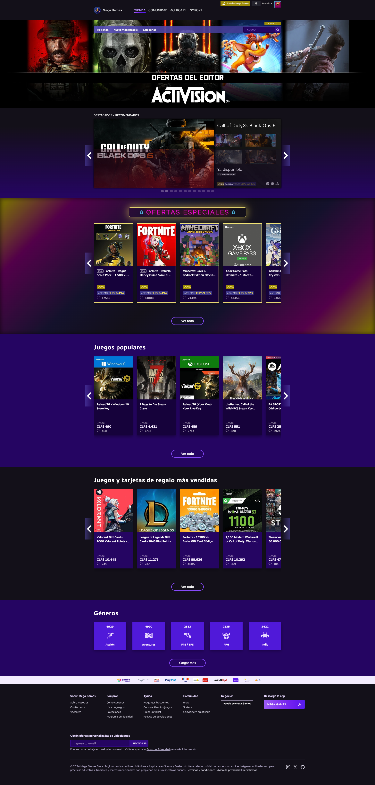
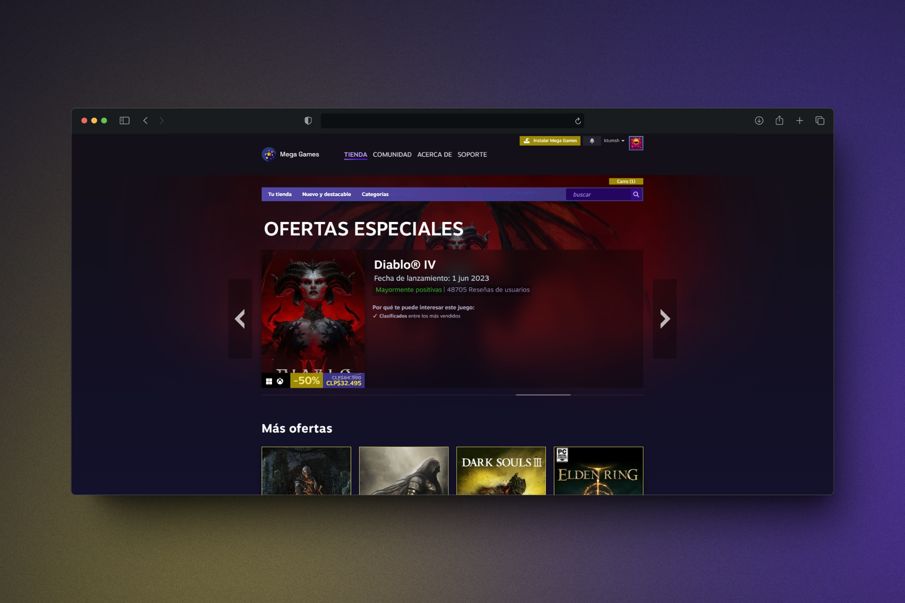
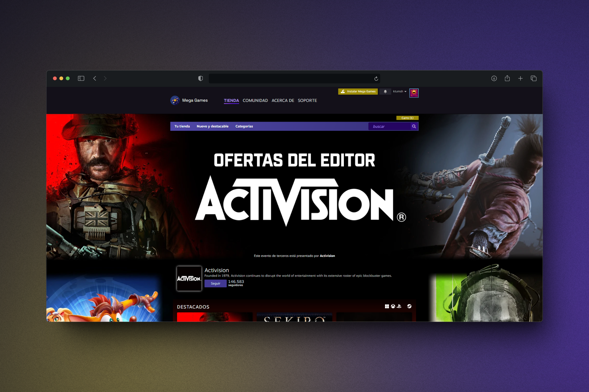

<a name="readme-top"></a>

<a href="https://github.com/Ktumsh/mega-games-django">
  
</a>

<div align="center">
  
# 🕹️ Mega Games Django 👋
  
Mega Games Store es una página de venta de juegos online creada por y para uso didáctico con el framework de Django la cuál está inspirada en Steam y Eneba.
</div>

<details>
<summary>Tabla de contenidos</summary>

- [✨ Características principales](#-características-principales)
  - [📸 Capturas de pantalla de Mega Games](#-capturas-de-pantalla-de-la-web-de-mega-games)
- [📋 Requisitos previos](#-requisitos-previos)
  - [Instalación de Python](#instalación-de-python)
- [⚙ Configuración del proyecto](#-configuración-del-proyecto)
- [➕ Adicionales](#-adicionales)
  - [Acceder a la ventana de administrador](#acceder-a-la-ventana-de-administrador)
  - [Configuración de variables de entorno](#configuración-de-variables-de-entorno)
- [🤝 Colaboradores](#-colaboradores)

</details>

## ✨ Características principales

- **Creación de usuario**: Puedes crear un usuario al ingresar a la página.
- **Sección principal**: Muestra la sección principal con accesos directos a secciones recomendadas.
- **Ofertas especiales**: Sección de ofertas especiales para mostrar juegos en oferta.
- **Ofertas del editor**: Sección para mostrar ofertas del editor de Activision.
- **Dar me gusta a juegos**: Puedes darle me gusta a juegos y se guardará el estado mientras navegas por la página.
- **Carrito de compras**: Puedes añadir juegos al carrito de compras más no comprarlos.

### 📸 Capturas de pantalla de la web de Mega Games






<p align="right">(<a href="#readme-top">volver arriba</a>)</p>

## 📋 Requisitos previos

- Python 3.x

### Instalación de Python

En Windows:

1. Descarga el instalador de Python desde [python.org](https://www.python.org/downloads/).
2. Ejecuta el instalador y asegúrate de seleccionar la opción "Add Python to PATH".
3. Sigue las instrucciones del instalador.

En macOS:

1. Abre la terminal.
2. Usa Homebrew para instalar Python:
```bash
brew install python
```

## ⚙ Configuración del proyecto

### 1. Clonar el repositorio 📂

1. Abre la terminal o el símbolo del sistema.
2. Clona el repositorio:
```bash
git clone https://github.com/ktumsh/mega-games-django.git
cd mega-games-django
```

### 2. Crear y activar un entorno virtual 🌐

En Windows:

```bash
python -m venv venv
venv\Scripts\activate
```

En Unix/macOS:
```bash
python3 -m venv venv
source venv/bin/activate
```

### 3. Instalar las dependencias 📦
```bash
pip install -r requirements.txt
```

### 4. Aplicar migraciones 🔄
```bash
python manage.py migrate
```

### 5. Crear un superusuario (opcional) 🛡️
```bash
python manage.py createsuperuser
```

### 6. Ejecutar el servidor de desarrollo 🚀
```bash
python manage.py runserver
```

### 7. Abrir la aplicación en el navegador 🌍

Abre un navegador web y navega a `http://127.0.0.1:8000/` para ver la aplicación en funcionamiento.

## ➕ Adicionales

### Acceder a la ventana de administrador

1. Abre un navegador web y navega a `http://127.0.0.1:8000/admin`.
2. Inicia sesión con las credenciales del superusuario que creaste anteriormente.

### Configuración de variables de entorno

1. Copia el archivo `.env.demo` y renómbralo a `.env`:
```bash
cp .env.demo .env
```
2. Abre el archivo .env y llena los valores necesarios:
```bash
SECRET_KEY=your-actual-secret-key
DEBUG=False
ALLOWED_HOSTS=127.0.0.1
```
3. Para obtener una secret key puedes copiar el siguiente comando en tu consola si es que tienes django instalado
```bash
from django.core.management.utils import get_random_secret_key; print(get_random_secret_key())
```
<p align="right">(<a href="#readme-top">volver arriba</a>)</p>

## 🤝 Colaboradores:
<details>
  <summary>:zap: Josué Barra</summary>
</details>

<details>
  <summary>:zap: Renato Rivera</summary>
</details>
